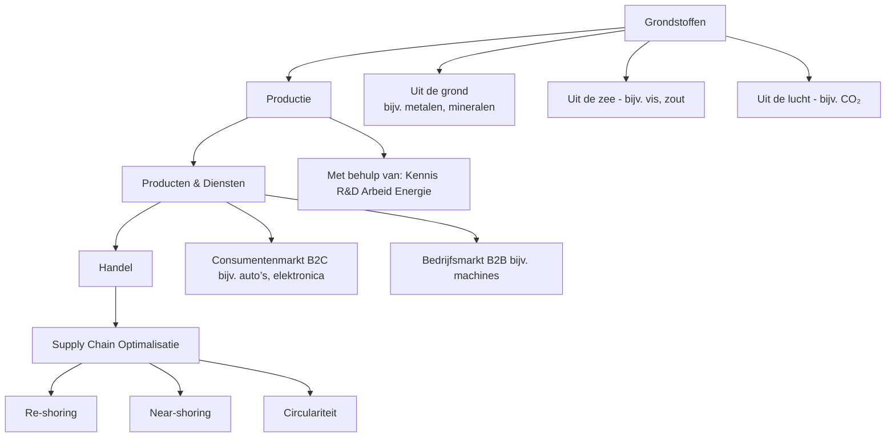
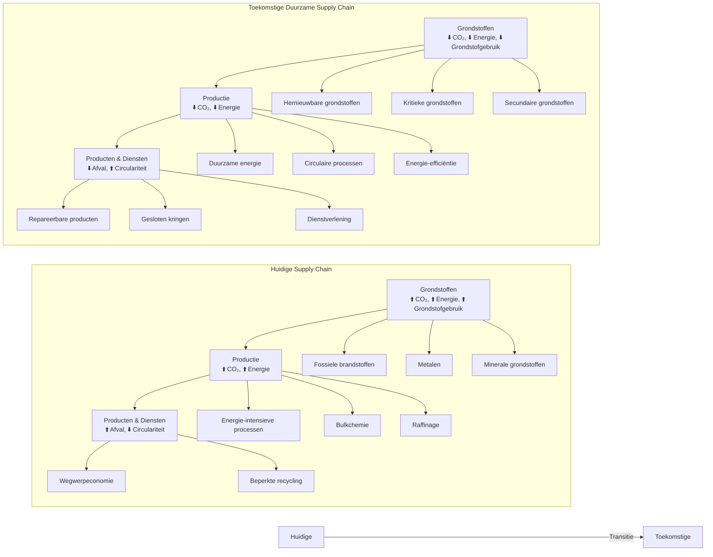
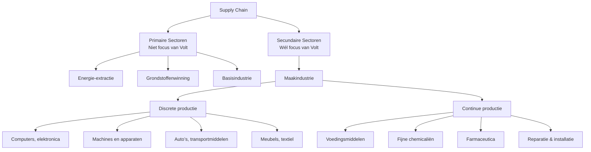
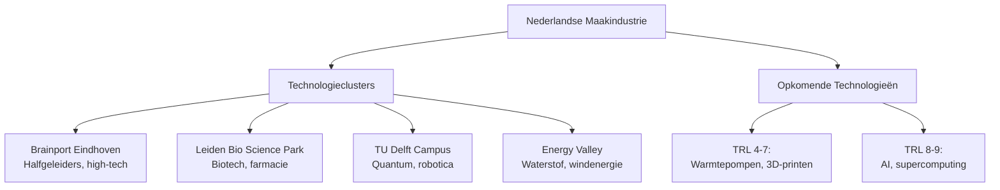
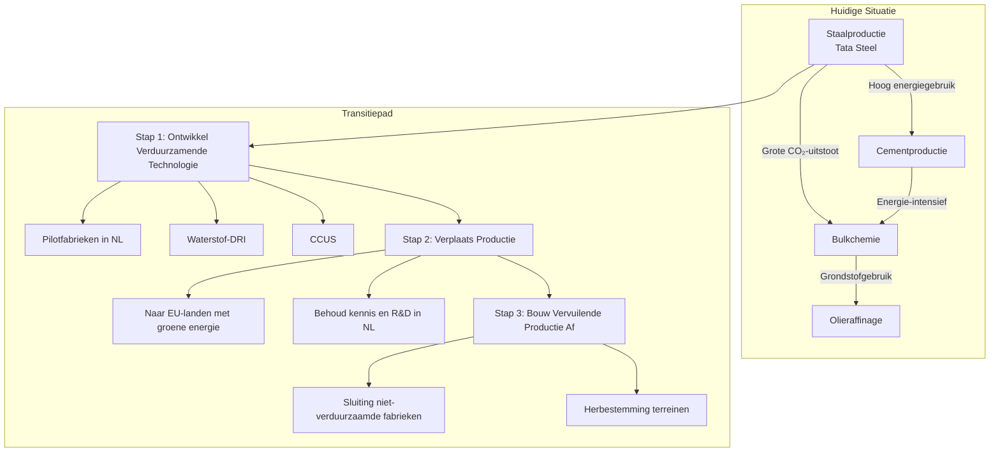
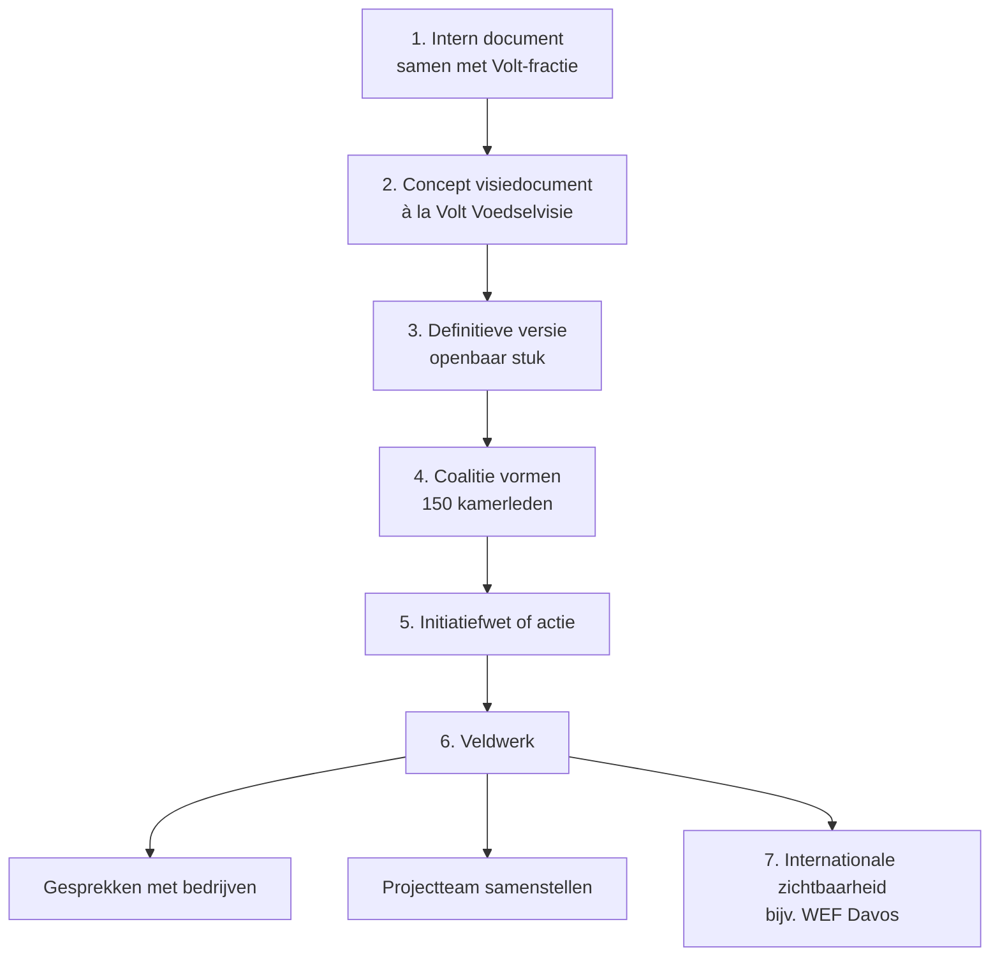

# **Volt en de Industrie**

**Een aanzet tot industriepolitiek voor Volt-Europa en Volt-Nederland**  
*Door Volt Engineers*  
*12 mei 2026*

---

---

## **Inleiding**

Volt streeft naar een **welvarend en autonoom Europa** dat duurzaam leeft binnen de grenzen van de planeet. Onze **toekomstvisie voor de fysieke omgeving** is:

> *Een welvarend en autonoom Europa dat met voornamelijk eigen duurzame energie en grondstoffen op eigen bodem, door middel van duurzame productieprocessen, duurzame producten en diensten ontwerpt, maakt en recycleert. Een Europa dat in een florerende economie handelt binnen de unie en met de wereld in zulke producten en diensten. En last but not least een Europa dat, uit welbegrepen eigenbelang, met respect voor alle facetten van de planeet, inclusief klimaat, een gezond leefklimaat in stand houdt en verbetert voor mens, plant en dier.*

---

---

## **Toekomstvisie voor de Europese Industrie**

Om onze keuzes te onderbouwen, analyseren we de **waardeketen (supply chain)** van de industrie.

---

### **Flow 1: De Waardeketen (Supply Chain) van de Industrie**



Deze keten wordt **voornamelijk door de markt** onderhouden, met **wetgeving** als sturing (bijv. arbeidswetten, milieu-eisen, subsidies).

---

---

## **Constatering: Uitdagingen in de Supply Chain**

Sinds de jaren '70 weten we dat de industrie **belastend is voor de planeet**:

- **CO₂-uitstoot** (broeikasgassen).
- **Grondstofverbruik** (uitputting van natuurlijke hulpbronnen).
- **Energieverbruik** (fossiele brandstoffen).

**Oplossingsrichtingen:**

- **Decarbonisatie**: CO₂-beprijzing, CO₂-opslag, CBAM.
- **Energiebesparing**: Efficiëntere processen, hernieuwbare energie.
- **Circulariteit**: Recycling, alternatieve materialen, gesloten kringen.

---

### **Flow 2: Verduurzaming van de Supply Chain**



---

---

## **Analyse: Focus op de Maakindustrie**

Om tot een **weloverwogen beleid** te komen, hanteren we een stapsgewijze benadering.

---

### **Criterium A: Grote krachten in de waardeketen**

**Vraag:** *Kan Volt invloed uitoefenen op dit aspect, gegeven de mondiale/Europese dynamiek?*

- **Energie-extractie en -aanvoer** → **Nee** (te grote mondiale krachten).
- **Grondstoffen** → **Nee**.
- **Basisindustrie** (staal, cement, bulkchemie) → **Nee**.

**Conclusie:** Volt richt zich op de **maakindustrie** (secundair segment).

---

### **Flow 3: Positie van de Maakindustrie in de Supply Chain**



---

### **Criterium B en C: Kansen in de EU en Nederlandse Maakindustrie**

De maakindustrie is **klaar voor verduurzaming** dankzij:

- **Kleinere ecologische voetafdruk** dan wereldgemiddelde.
- **Gezonde economische indicatoren** (zie **Appendix II**).

Nederland speelt een **sterke rol** in opkomende technologieën, zoals:

- Industriële warmtepompen (>150°C).
- Additive manufacturing (3D-printen).
- Chemische recycling.

---

### **Flow 4: Nederlandse Sterktes in de Supply Chain**



---

---

## **Conclusie: Toekomstvisie en Industriepolitiek**

**Toekomstvisie:**

> *Een welvarend en autonoom Europa dat met voornamelijk eigen duurzame energie en grondstoffen op eigen bodem d.m.v. duurzame productieprocessen duurzame producten en diensten ontwerpt, maakt en recycleert.*

**Hoe bereiken we dit?**  
Door **gerichte industriepolitiek** langs **drie paden**:

---

### **Pad A: Overkoepelende Thema’s voor de Maakindustrie**


| **Thema**               | **Actie**                                     | **Impact op Supply Chain**               |
| ----------------------- | --------------------------------------------- | ---------------------------------------- |
| Geografische verkorting | Re-shoring, lokale productie                  | ⬇️ Transport (energie/CO₂), ⬇️ logistiek |
| Recycling opschalen     | Reparatiebare producten, circulaire ontwerpen | ⬇️ Grondstofgebruik, ⬆️ circulariteit    |
| AI voor productie       | Sector-specifieke AI-ontwikkeling             | ⬆️ Productiviteit, ⬇️ verliezen          |
| Smart watermanagement   | Holistische benadering                        | ⬆️ Efficiëntie watergebruik              |
| Bouwen in hout          | Fabrieksmatige productie, bamboe              | ⬇️ CO₂ (opslag), ⬇️ staal/cement         |


---

### **Pad B: Uitfaseren Vervuilende Subsectoren**

**Doelgroepen:**

- Staalproductie (bijv. Tata Steel IJmuiden).
- Cementproductie.
- Bulkchemie en bulkplastics.
- Olieraffinage.

---

### **Flow 5: Uitfasering en Verduurzaming**



---

### **Pad C: Ontwikkelen Subsectoren met Toekomstperspectief**

**Focusgebieden:**

- **Digitalisering & AI**: Halfgeleiders (ASML, NXP), quantum, fotonica.
- **Veiligheid & Weerbaarheid**: Defensie (6G, radar, lasersatellietcommunicatie).
- **Energie & Klimaat**: Cleantech, electrolyzers, SMR’s, groene chemie.
- **Life Sciences & Biotech**: Biotech Nexus, Scale-Out Fund, gezondheidsdata.

---

### **Flow 6: Ontwikkeling van Toekomstgerichte Subsectoren**

```mermaid
flowchart TD
    A[Subsectoren met Toekomstperspectief] --> B[Digitalisering & AI]
    A --> C[Veiligheid & Weerbaarheid]
    A --> D[Energie & Klimaat]
    A --> E[Life Sciences & Biotech]

    B --> B1[Halfgeleiders\n(ASML, NXP, CHIPNL)]
    B --> B2[Quantum computing]
    B --> B3[Fotonica]

    C --> C1[Europese satellietcapaciteit]
    C --> C2[Dual-use technologie]
    C --> C3[Nederlandse DARPA]

    D --> D1[Cleantech\n(waterstof, wind)]
    D --> D2[Electrolyzers]
    D --> D3[SMR’s]
    D --> D4[Groene chemie]

    E --> E1[Biotech Nexus]
    E --> E2[Scale-Out Fund]
    E --> E3[AI in de zorg]
```

---

---

## **Next Steps: Van Visie naar Beleid**

---

### **Flow 7: Van Concept naar Implementatie**



---

---

## **Appendices**

---

### **Appendix I: Staand Beleid Volt**

- **Volt Nederland Verkiezingsprogramma 2025**:
  - Industrievisie gericht op **duurzame maakindustrie**.
  - **Europese organisatie** van industrie (coördinatie via Europese minister).
  - **Verduurzaming** van bestaande industrie (CO₂-heffing, vergunningen intrekken bij niet-naleving).
  - **Specifieke keuzes**: Geen verdere investering in Tata Steel IJmuiden; focus op **First-of-a-Kind-projecten** (elektrolysers, groene chemie).
- **Volt Europa – Moonshot Programma**:
  - **Verdrievoudigen Horizon Europe-budget**.
  - **Europese industriële strategie** (clusters, infrastructuur).
  - **Groene economie** (CO₂-heffingen, circulaire productie).

---

### **Appendix II: Energie-, CO₂-, en Economische Indicatoren per Sector**

#### **Wereldwijde Cijfers**


| **Sector**                      | **Gross Operating Rate (%)** | **R&D Rate (%)** | **Energie-intensiteit (GWh/€ bn)** | **CO₂-intensiteit (kt/€ bn)** |
| ------------------------------- | ---------------------------- | ---------------- | ---------------------------------- | ----------------------------- |
| Agriculture, Forestry & Fishing | 27.4                         | 0.1              | 310                                | 257                           |
| Mining & Quarrying              | 25.4                         | 0.9              | 211                                | 196                           |
| Manufacturing                   | 16.1                         | 9.2              | 580                                | 170                           |


#### **Europese Unie Cijfers**


| **Sector**                      | **Gross Operating Rate (%)** | **R&D Rate (%)** | **Energie-intensiteit (GWh/€ bn)** | **CO₂-intensiteit (kt/€ bn)** |
| ------------------------------- | ---------------------------- | ---------------- | ---------------------------------- | ----------------------------- |
| Agriculture, Forestry & Fishing | 20.1                         | 0.5              | 569                                | 736                           |
| Manufacturing                   | 10.8                         | 5.7              | 226                                | 84                            |


---

### **Appendix III: Opkomende Technologieën voor de Maakindustrie**


| **Technologie**                     | **Top 5 Landen (EU)**        | **TRL** | **Jaren tot Mainstream** | **Investering (€ mld)** |
| ----------------------------------- | ---------------------------- | ------- | ------------------------ | ----------------------- |
| Industrial heat pumps (>150°C)      | Nederland, Duitsland, Zweden | 5       | 6                        | 7.5                     |
| Additive manufacturing (3D-printen) | Nederland, Duitsland         | 7       | 3                        | 20                      |
| Chemical recycling                  | Nederland, Duitsland         | 6       | 7                        | 12.5                    |


---

### **Appendix IV: Nederlandse Technologieclusters**


| **Cluster**             | **Regio** | **Focus**                         | **Werkgelegenheid** | **Belangrijke Spelers** |
| ----------------------- | --------- | --------------------------------- | ------------------- | ----------------------- |
| Brainport Eindhoven     | Eindhoven | Halfgeleiders, high-tech systemen | 76.000              | ASML, NXP, Philips      |
| Leiden Bio Science Park | Leiden    | Biotech, farmacie                 | 27.000              | Janssen, Galapagos      |
| TU Delft Campus         | Delft     | Quantum, robotica, cleantech      | 10.000              | TU Delft, TNO           |


---

### **Appendix V: Samenvatting Analyse Wennink-Rapport**


| **Thema**                  | **Samenvatting**                   | **Overeenkomst met Volt**          | **Verschil met Volt**                                       |
| -------------------------- | ---------------------------------- | ---------------------------------- | ----------------------------------------------------------- |
| **Strategische autonomie** | Focus op 'strategische relevantie' | Eens met bewuste industriepolitiek | Volt kiest voor **strategische autonomie + diversificatie** |
| **Innovatie**              | Focus op AI, chips, digitalisering | Eens met strategische domeinen     | Volt benadrukt **circulariteit en duurzaamheid**            |


---
